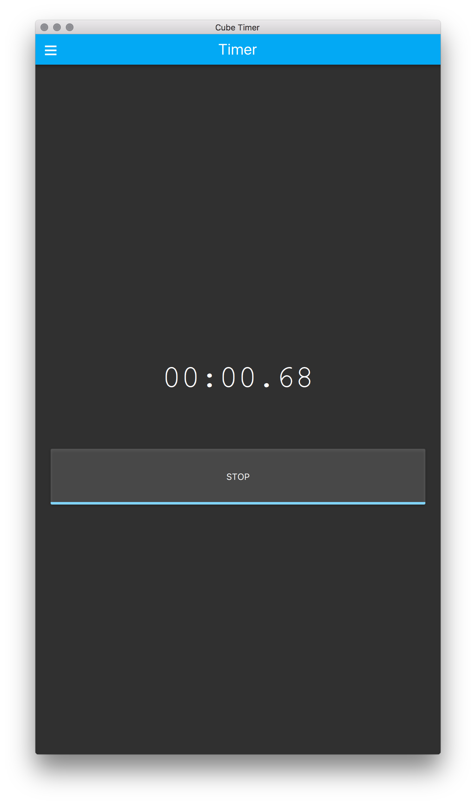
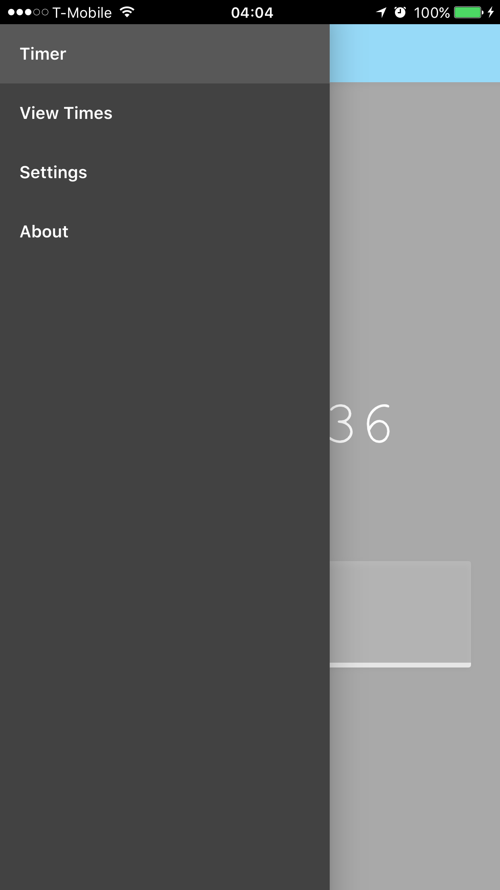

# CubeTimer
Simple speedcubing timer.

<p align="center">
  
  
</p>

## Getting Started


### Prerequisites


```
```

### Installing


```
```

## Deployment


## Built With

* [Qt](https://www.qt.io/)
* [QtWebApp](http://stefanfrings.de/qtwebapp/index.html)

## Contributing


## Authors


## License

This project is licensed under the MIT License - see the [LICENSE.md](LICENSE.md) file for details

## Acknowledgments
* [README-Template.md](https://gist.github.com/PurpleBooth/109311bb0361f32d87a2)
